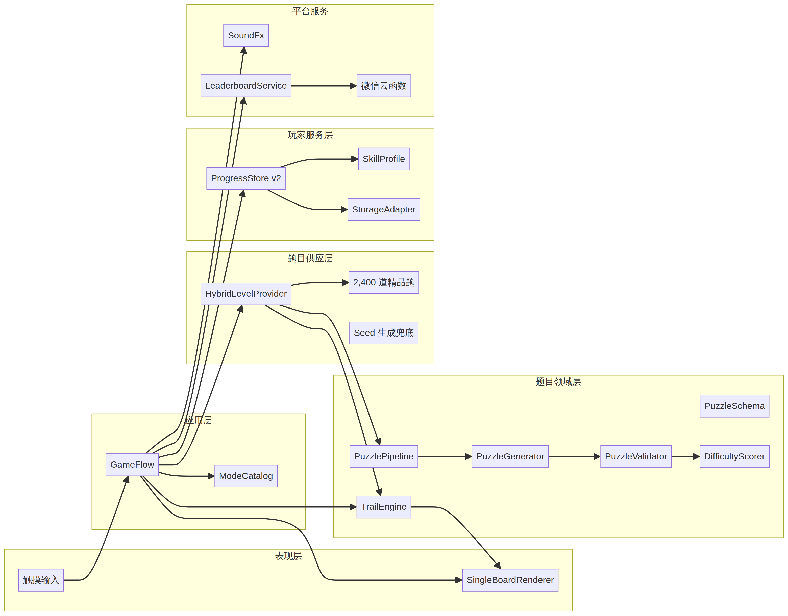

# 森林寻径微信小游戏架构完善报告

**作者：Manus AI**  
**版本：v1.2.0**  
**日期：2026-09-02**

## 1. 执行摘要

本次工作通读了用户提供的《连线游戏设计架构》并实际分析了参考游戏。参考产品将同一套数字连线路径规则组织为 Daily、Unlimited、Progressive 与 Beat the Clock 四种模式：Unlimited 允许选择棋盘和难度；Progressive 随关卡逐步增加棋盘、墙体与路标复杂度；Beat the Clock 使用连续出题和时间银行；Daily 为所有玩家提供同一天的共享题目。[1] [2] [3] 这些产品机制的共同前提不是四套游戏代码，而是**一个规则引擎、一个题目契约和多种选题/结算策略**。

原工程最初具备 2,400 道精品题、纯 JavaScript 规则引擎、Canvas 渲染、本地存档、限时挑战、音效和云排行榜，但选题、模式、进度与平台服务主要集中在 `GameFlow`。在 v1.1 完成分层重构后，v1.2 已将精品题扩充为 20,000 道原创关卡，并改为按“尺寸 × 难度”懒加载紧凑记录，避免在小游戏启动时展开完整对象数组。

> 本次实现的重点是建立“可继续演进”的客户端基础，而不是在小游戏包内模拟设计文档中的千万用户后端。Redis 候选池、离线百万题生产、服务端唯一解集群和异步排行榜被保留为后续服务端阶段。

## 2. 参考游戏与设计文档的落地决策

参考游戏的规则页明确要求：从数字 1 开始，只能上下左右移动，按顺序经过数字格，不能穿墙，每个格子恰好经过一次，并在最大数字结束。[4] 因此，游戏的核心资产应当是可版本化的题目数据和平台无关的规则引擎；模式、音效、弹窗和排行榜只能作为上层策略存在。

| 输入要求 | 本次决策 | 落地结果 |
|---|---|---|
| 程序化海量题目 | 不以完整对象数组作为运行时载荷 | 新增确定性 Seed、20,000 道精品题和紧凑分桶混合供应 |
| 题目质量控制 | 生成与验证必须成为同一管线 | 新增结构校验、标准解校验、小棋盘唯一解计数和多解加墙消歧 |
| 难度分级 | 不只依靠棋盘尺寸 | 综合路标密度、墙密度、转弯、分支和求解统计输出难度画像 |
| 千人千面 | 先建立可解释的轻量能力分 | 新增 0–2000 Rating、最近 256 题防重复和模式序列 |
| 多玩法复用 | 模式尽量复用共享层 | Daily、Unlimited、Clock 共用 Provider、Pipeline 与 TrailEngine；关卡挑战复用 Provider、渲染与进度层，玩法引擎为 ChallengeEngine |
| 千万用户架构 | 客户端只预留稳定契约 | 数据库、Redis、离线生产与反作弊延后到服务端阶段 |

## 3. 已落地的分层架构



| 层级 | 关键模块 | 当前职责 |
|---|---|---|
| 表现层 | `SingleBoardRenderer` | 棋盘、控制区、模式入口、弹窗和触摸热区渲染 |
| 应用层 | `GameFlow`、`ModeCatalog` | 局生命周期、模式切换、计时、结算和 ViewModel 组装 |
| 题目领域层 | `PuzzleSchema`、`PuzzleGenerator`、`PuzzleValidator`、`DifficultyScorer`、`PuzzlePipeline`、`TrailEngine` | 题目契约、Seed、生成、质量门禁、难度、移动规则和局内快照 |
| 题目供应层 | `HybridLevelProvider` | 精品题优先、Seed 生成兜底、每日题、关卡挑战题和限时题供应 |
| 玩家服务层 | `ProgressStore`、`SkillProfile` | v1→v2 迁移、最佳成绩、连胜、能力分、防重复和未完成局恢复 |
| 平台服务层 | `StorageAdapter`、`SoundFx`、`LeaderboardService` | 微信存储、音频和云排行榜能力 |

依赖方向已经明确为“上层调用下层接口”。`TrailEngine` 与题目管线不依赖 `wx`、Canvas 或网络；`GameFlow` 不再直接生成题目或扫描完整题包；`ProgressStore` 通过可替换的 StorageAdapter 持久化，因此可以在 Node.js 测试环境中使用内存适配器。

## 4. 题目领域模型与质量门禁

`PuzzleSchema` 把题目升级为版本 2 契约。静态题和生成题都具有统一的 `id`、`gridSize`、`difficulty`、`sourceKind`、`waypoints`、`walls` 与 `solution`；生成题额外记录 `seed`、生成器版本、重试次数、验证状态和求解统计。缺失 ID 的生成题会根据可见约束计算稳定身份，同一 Seed 可以复现相同结果。

`PuzzleGenerator` 先以确定性随机数生成 Hamilton 路径，并在必要时使用可验证的蛇形路径兜底；墙体只放在标准路径未使用的边上，因此不会破坏标准解；Easy、Medium、Hard 与 Expert 使用不同的数字密度和墙体密度，其中 Easy 路标更多、Hard 路标更少，修正了旧实现中难度越高提示数字反而越多的问题。

`PuzzleValidator` 执行边界、路标编号、重复格、相邻移动、墙体、全覆盖、起点与终点检查。6×6 及以下的运行时生成题进入带节点预算的唯一解计数；若发现多解，`PuzzlePipeline` 会从替代解中定位一条不属于标准路径的边，加墙阻断后重新验证，直到达到唯一解门禁或重试失败。8×8 及以上的运行时生成题只验证标准解，避免在低端设备上执行指数级搜索；生产环境应在服务端离线完成大棋盘唯一解验证后再下发。

| 质量阶段 | 输出 | 失败策略 |
|---|---|---|
| 契约规范化 | 标准尺寸、墙体、路标和稳定 ID | 拒绝非法题目 |
| 候选生成 | 可复现标准路径、墙体和路标 | 切换确定性兜底路径 |
| 标准解验证 | 全覆盖且不穿墙的合法解 | 更换 attempt Seed 重试 |
| 小棋盘唯一解 | `unique / multiple / unsolved / budget-exhausted` | 对替代解加墙消歧或重试 |
| 难度评分 | 0–100 分、标签、0–2000 Rating 和解释字段 | 保留请求标签并记录真实画像 |

## 5. 题目供应与四种模式

`HybridLevelProvider` 通过 `catalogManifest` 按需加载“尺寸 × 难度”记录桶，并只还原当前待玩的关卡。Unlimited 优先从 20,000 道精品题中选择未完成且最近未玩的题；当对应题池耗尽或题包加载失败时，自动转入 Seed 生成兜底。启动入口也改为 Promise 化分包流程，即使 catalog 分包失败，游戏仍能依靠生成器继续运行。

参考游戏的 Beat the Clock 页面为不同档位提供不同的每局奖励时间，并让难度随波次升级。[3] 新版本已把时间奖励调整为 Easy +10 秒、Medium +7 秒、Hard +5 秒、Expert +3 秒；各档位可以在若干局后提升棋盘尺寸。Daily 使用 Asia/Shanghai 日期 Seed；关卡挑战提供水果乐园与太空旅行两套各 5 关的主题关，玩家可自由选择、按图案顺序点选连线；Unlimited 保留玩家自由选择的 6×6–12×12 与三档难度。

| 模式 | Seed/选题键 | 进度 | 结算 |
|---|---|---|---|
| Unlimited | `gridSize + difficulty + ordinal` | 组合序列、最近题和完成状态 | 最佳步数、时间、能力分 |
| Daily | `Asia/Shanghai + date` | 日期完成与 streak | 当日成绩与排行榜作用域 |
| Challenge | 主题关卡固定关卡 ID（`core/challenge/ChallengeLevels.js`） | 每关星级与最佳成绩 | 按目标时间判定星级 |
| Clock | `tier + ordinal`（Seed）+ 本局已解题数（尺寸） | 每档 ordinal 和最佳成绩 | 解题数、剩余时间与奖励秒数 |

游戏控制区现已直接提供“每日挑战”和“🎯 关卡挑战”入口；限时弹窗展示每个档位的真实奖励秒数。Unlimited / Daily / Clock 复用同一个 `TrailEngine`（相邻拖动、覆盖全盘）；关卡挑战改用 `ChallengeEngine`（按目标图案顺序点选、任意两格连线、不要求覆盖全盘；直线穿过障碍格则拒绝），两者共用渲染器、进度与结算层。关卡挑战每套第 3–5 关为记忆关：`GameFlow` 记录预览截止时间与纠错显形截止时间，`view().challengeMemory` 向渲染器提供预览倒计时、`mode`（faded / hidden / flash）、是否处于隐藏阶段与“当前目标图案”。淡影关未点选图案以低透明度绘制；全藏关不绘制未点选图案；闪现关仅在闪光窗口绘制未点选图案。数字连线进行中不再绘制下一个目标底圈，玩家自行寻找下一数字。状态条改显当前目标（`showTargetName` 控制是否显示名称）。水果第 4 关额外提供分类节奏光带（`challengeRhythm`）：预览/显形时给甜酸果香热带格子上色，隐藏记忆时只保留顶部节奏条以免泄露位置。通关特效按主题切换为丰收落果或星云旋点。集齐一套主题 5 关解锁对应奖励皮肤，并点亮关卡类徽章。

## 6. 进度、能力与恢复

`ProgressStore` 的状态版本已从 v1 升级到 v2，并自动保留旧版本中的完成记录、最佳成绩、每日记录、限时记录、音效开关和连胜。新增 `sequences`、`recentPuzzleIds`、`activeSessions` 与 `skill`；最近题目列表最多保存 256 个 ID，避免本地存储无限增长。

玩家能力分初始值为 500。每次完成后，系统根据题目 Rating、是否完成、撤回次数和提示次数进行轻量更新；前五局使用较高更新系数，以更快建立初始画像。该方案是可解释的客户端冷启动机制，不等同于设计文档中需要长期行为数据的强化学习推荐。

未完成棋局会保存题目对象和 `TrailEngine` 序列化路径。下次启动相同模式与规格时，游戏恢复最近一局，并通过规则引擎重新播放路径进行安全校验；路径与当前题目不匹配时会放弃存档而不是直接注入内部状态。

## 7. 自动化验证结果

发布包过去声明了测试命令，但实际缺少相应 `test/` 与 `scripts/` 文件。v1.1.0 已补齐跨平台测试脚本，并将 `npm run verify` 修正为可执行命令。

| 验证项 | 结果 |
|---|---|
| JavaScript 语法检查 | **25 个运行时代码文件通过** |
| Seed 可复现、难度数字密度和唯一解门禁 | **通过** |
| 规则引擎序列化与恢复 | **通过** |
| v1→v2 存档迁移、能力分和防重复 | **通过** |
| Unlimited、Daily、Challenge、Clock 集成流程 | **通过** |
| 每日/关卡挑战入口与 +10/+7/+5/+3 秒渲染 | **通过** |
| 数字连线提示音与通关鼓声音效 | **通过** |
| 原创精品题库结构、标准解与紧凑记录 | **20,000/20,000 通过** |

验证命令为：

```bash
npm run verify
```

## 8. 保留的既有调整

本次架构重构没有覆盖此前确认的视听参数。背景音乐仍使用最初的音乐资源；数字连线提示音保持增强后的三段增益；标准模式通关弹窗仍播放用户提供的鼓声音频；棋盘数字和连线使用上一版缩小三分之一后的大小；连线颜色仍为恢复后的原始绿色渐变。

## 9. 已知边界与后续路线图

| 阶段 | 建议工作 | 触发条件 |
|---|---|---|
| v1.2 客户端 | 把排行榜评分、作用域和 UI 文案进一步拆开；完善新手引导、分享和埋点事件码 | 当前版本稳定上线后 |
| v2.0 题目服务 | 后端离线批量生成；8×8–12×12 唯一解验证；按版本签名下发题目 | 日活与题目消耗需要超出本地精品题包时 |
| v2.1 推荐服务 | 玩家画像、服务端最近题集合、候选池和 A/B 难度调节 | 积累足够完成率、耗时和放弃数据后 |
| v3.0 大规模基础设施 | Redis 候选队列、数据库模板/实例拆分、异步排行榜和操作日志反作弊 | 实际并发、榜单量和作弊风险证明需要时 |

云排行榜仍直接接受客户端结果，并在提交时执行实时排名统计；这不应被视为面向千万用户的最终实现。后续应由服务端根据题目版本、Seed、路径摘要和时间窗口计算成绩，并把实时 `count()` 改为缓存或异步排名。大棋盘运行时生成目前也没有在设备端证明唯一解，因此 Daily 与正式比赛题应优先使用离线验证过的精品题或服务端题目。

## 10. 工程使用

将发布压缩包完整解压后，在微信开发者工具中选择顶层同时包含 `game.js`、`game.json` 与 `project.config.json` 的文件夹。测试目录属于开发辅助文件，不参与小游戏运行；如需验证架构，在安装 Node.js 的环境中执行 `npm run verify`。

## References

[1]: https://www.zipgameunlimited.com/unlimited "Zip Game Unlimited — Unlimited Mode"
[2]: https://www.zipgameunlimited.com/progressive "Zip Game Unlimited — Progressive Mode"
[3]: https://www.zipgameunlimited.com/beat-the-clock "Beat the Clock — Timed Zip Puzzle Runs"
[4]: https://www.zipgameunlimited.com/how-to-play "How to Play Zip Game"
